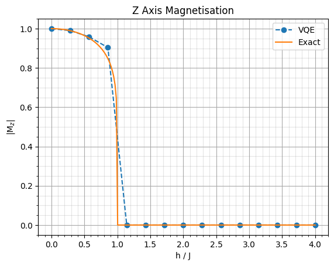

# ising_ground

Python 3.11 Jupyter Notebook focussed on finding and studying the ground state of the 1D transverse field Ising model. This is done both analytically and through a Variational Quantum Eigensolver (VQE).

### How to use
- Clone the repository using the URL `https://github.com/martinzf/ising_ground.git`.
- Open your terminal in the cloned project's folder. Create a virtual environment with the command `python -m venv venv`, followed by `venv/Scripts/activate`.
- To install dependencies in the virtual environment use the command `pip install -r requirements.txt`.
